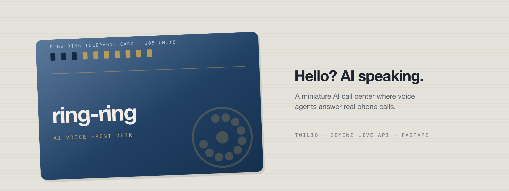
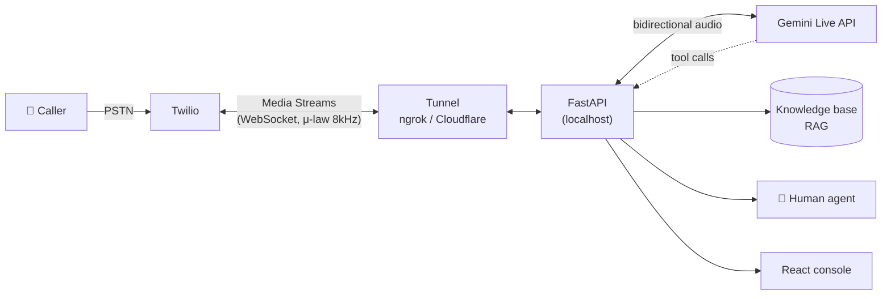

<p align="center">
  
</p>

<h1 align="center">moshi-moshi</h1>

<p align="center">
  <strong>Hello? AI speaking.</strong><br>
  A miniature AI call center where voice agents answer real phone calls.
</p>

<p align="center">
  
  
  
  
</p>

---

## Overview

**moshi-moshi** replaces the first line of a phone support desk with AI.

Someone calls a real phone number, an AI voice agent picks up, understands what they
need, looks up the answer, and either resolves the call or hands it over to a human.
That is the whole idea — a call center, shrunk down to something one person can build.

> **On the name.** In Japan a phone call opens with *"moshi moshi"* (もしもし) — the
> equivalent of "hello?" when you pick up the receiver. This project starts where every
> phone call starts.

**Status: Milestone 0.** The repository is being set up. Nothing below is wired up yet —
see [ROADMAP.md](ROADMAP.md) for what gets built when.

## Features

| | Feature | Milestone |
|---|---|---|
| ☐ | **Real phone calls** over the PSTN via Twilio, bridged into a web backend | [M1](ROADMAP.md#milestone-1--talk-to-an-ai-over-the-phone) |
| ☐ | **Natural voice conversation** using a speech-to-speech model (Gemini Live API) — no STT → LLM → TTS chain, no robot cadence | [M1](ROADMAP.md#milestone-1--talk-to-an-ai-over-the-phone) |
| ☐ | **Call session management** — call IDs, duration, disconnect reasons, traceable logs | [M2](ROADMAP.md#milestone-2--manage-call-sessions) |
| ☐ | **Tool calling** — the agent runs real backend functions instead of guessing | [M3](ROADMAP.md#milestone-3--let-the-ai-call-the-backend) |
| ☐ | **RAG over internal knowledge** — FAQs and manuals searched mid-call, so the first response is actually interactive | [M4](ROADMAP.md#milestone-4--answer-from-internal-knowledge-rag) |
| ☐ | **Escalation to a human** as the second line, when the AI can't close the call | [M5](ROADMAP.md#milestone-5--become-a-miniature-call-center) |
| ☐ | **Multi-tenant operation** — each tenant with its own number, knowledge, AI staff and dashboard, behind one operator console | [M6](ROADMAP.md#milestone-6--become-a-multi-tenant-service) |

## How it works



Audio flows both ways in real time: Twilio streams the caller's voice to FastAPI over a
WebSocket, FastAPI relays it to Gemini Live, and the model's speech goes straight back
down the same pipe. Everything runs on a laptop, exposed through a tunnel — no cloud
infrastructure until it's actually needed.

## Tech stack

| Layer | Choice |
|---|---|
| Backend | Python 3.12+ · [FastAPI](https://fastapi.tiangolo.com/) · [SQLAlchemy](https://www.sqlalchemy.org/) + [Alembic](https://alembic.sqlalchemy.org/) for persistence and migrations (from [M2](ROADMAP.md#milestone-2--manage-call-sessions)) |
| Frontend | TypeScript · React · [Vite](https://vite.dev/) · Tailwind CSS |
| Voice AI | [Gemini Live API](https://ai.google.dev/gemini-api/docs/live) (Gemini 2.5, GA) — speech-to-speech |
| Telephony | [Twilio](https://www.twilio.com/docs/voice) Programmable Voice + Media Streams |
| Data | [PostgreSQL](https://www.postgresql.org/) — call sessions, history, tenants (arrives at [M2](ROADMAP.md#milestone-2--manage-call-sessions)) |
| Vector store | [pgvector](https://github.com/pgvector/pgvector) — RAG embeddings (arrives at [M4](ROADMAP.md#milestone-4--answer-from-internal-knowledge-rag)). Not finally decided; it is the default because Postgres is already there. |
| Tooling | [uv](https://docs.astral.sh/uv/) · [Ruff](https://docs.astral.sh/ruff/) · mypy · pytest |
| Packaging | Docker |
| Process | [GitHub Spec Kit](https://github.com/github/spec-kit) (Spec Driven Development) |

Infrastructure and cloud are deliberately deferred. Everything runs locally first.

## Repository layout

A monorepo. Planned shape — directories appear as milestones land:

```
moshi-moshi/
├── apps/
│   ├── api/          # Python / FastAPI — Twilio webhooks, media bridge, agent tools
│   └── web/          # TypeScript / React — tenant and operator consoles
├── packages/         # shared types and contracts
├── specs/            # GitHub Spec Kit specs and plans
├── docs/
│   ├── design/       # palette, dial mark, type — see BRAND.md
│   └── assets/       # hero banners
├── CLAUDE.md         # conventions for AI contributors
└── ROADMAP.md
```

## Design

The banner above is the identity: a prepaid telephone card in deep navy, printed in ivory, with
brass punch marks. The palette, the dial mark and the type rules are written down in
[`docs/design/BRAND.md`](docs/design/BRAND.md), with the values as CSS custom properties in
[`docs/design/tokens.css`](docs/design/tokens.css) — the operator console should be built from those
rather than from fresh choices.

## Getting started

Not yet. There is nothing to run until [Milestone 1](ROADMAP.md#milestone-1--talk-to-an-ai-over-the-phone)
lands. Setup instructions arrive with it.

## Roadmap

| | Milestone | Outcome |
|---|---|---|
| **M0** | [Development environment](ROADMAP.md#milestone-0--set-up-the-repository) | The repo is ready to build in |
| **M1** | [Talk to an AI over the phone](ROADMAP.md#milestone-1--talk-to-an-ai-over-the-phone) | **It's a phone call!** |
| **M2** | [Manage call sessions](ROADMAP.md#milestone-2--manage-call-sessions) | It keeps records |
| **M3** | [Let the AI call the backend](ROADMAP.md#milestone-3--let-the-ai-call-the-backend) | It does real work |
| **M4** | [Answer from internal knowledge](ROADMAP.md#milestone-4--answer-from-internal-knowledge-rag) | It looks things up |
| **M5** | [Become a miniature call center](ROADMAP.md#milestone-5--become-a-miniature-call-center) | It's a call center |
| **M6** | [Become a multi-tenant service](ROADMAP.md#milestone-6--become-a-multi-tenant-service) | It's a service |

Full detail in [ROADMAP.md](ROADMAP.md).

## Development

This project is an experiment in **AI-DLC (AI-Driven Life Cycle)** as much as it is a
voice bot. Development runs on Spec Driven Development with GitHub Spec Kit, and one rule
holds above all others:

> **No human writes a line of the code.** Specs, review, and direction are human. The
> implementation is not. Spec Kit itself is optional; this rule is not.

Working conventions:

- Work starts from a GitHub issue, on a branch cut from `main`, and lands through a pull
  request into `main`.
- Branches are named `<type>/<issue-number>-<short-description>` — for example
  `feature/12-model-selector` or `chore/3-tech-stack-setup`.
- Detailed conventions for AI contributors live in `CLAUDE.md`.

## Out of scope

- **Languages other than Japanese.** Japanese only, for now. Other languages are a maybe,
  not a plan.
- **Commercial use.** This is a personal, hobby project and is not headed for production
  as a product.
